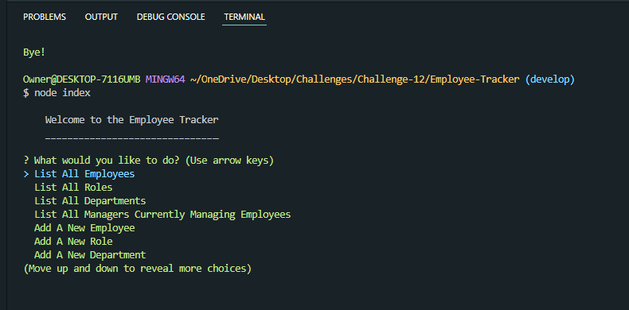

# Employee Tracker

## Description

This application allows the user to view and interact with an informational database that stores employees, departments, jobs, and managers using a CLI.

## Table of Contents

- [Installation](#installation)
- [Usage](#usage)
- [Questions](#questions)

## Installation

It can be downloaded through github.

## Usage

Open the application, install the packages and, using node, run 'node index' to start.

## Questions

Have questions? feel free to reach me here:

archied5150@yahoo.com
https://github.com/ArchieDonaho

